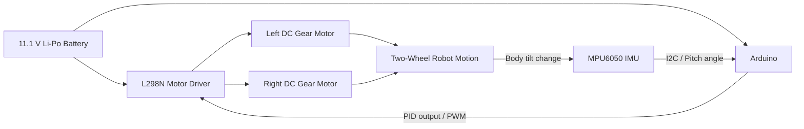
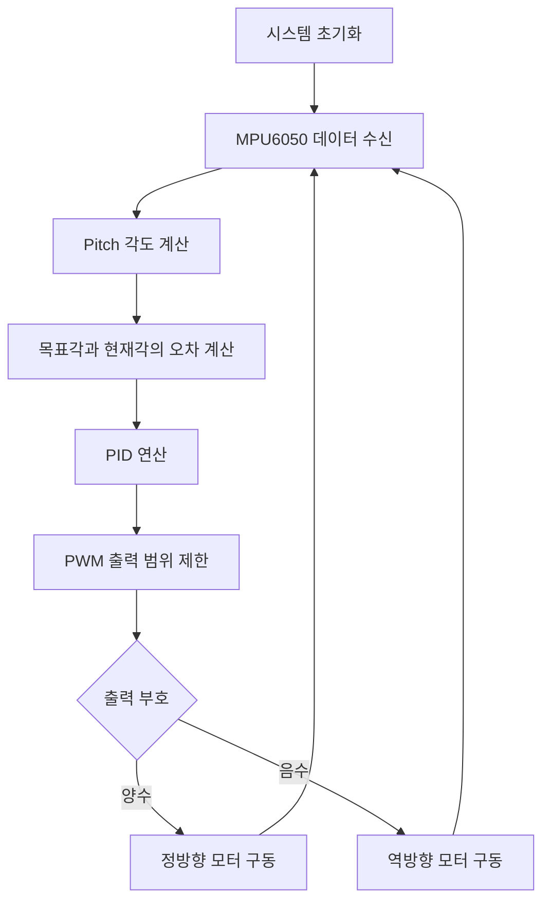

# BalancingRobot-Arduino

Arduino와 MPU6050 IMU 센서를 이용해 로봇의 앞뒤 기울기(Pitch)를 측정하고, PID 제어 결과를 DC 기어드 모터의 PWM으로 출력하여 두 바퀴 로봇이 넘어지지 않도록 균형을 유지하는 프로젝트입니다.

하드웨어 설계, 3D 프린팅 본체 제작, 센서 데이터 처리, PID 제어기 구현 및 게인 튜닝 과정을 수행했습니다.

---

## 1. 프로젝트 목표

- MPU6050의 자세 데이터를 이용한 실시간 기울기 측정
- PID 제어 기반의 두 바퀴 자립 제어
- L298N 모터 드라이버를 이용한 양쪽 DC 모터 제어
- 3D 프린팅을 활용한 상·하단 프레임 제작
- Arduino Serial Plotter를 이용한 목표각, 현재각, 제어출력 분석

---

## 2. 주요 기능

- MPU6050 DMP(Digital Motion Processor) 초기화
- Quaternion과 중력 벡터를 이용한 Yaw·Pitch·Roll 계산
- `ypr[1]`의 Pitch 값을 로봇의 앞뒤 기울기로 사용
- 10 ms 주기의 PID 연산
- PID 출력값에 따른 모터 방향 및 PWM 제어
- 목표각, 현재각, PID 출력값의 시리얼 출력
- 3D 프린터용 하단 프레임 G-code 보관

---

## 3. 시스템 구성



### 제어 흐름



---

## 4. 사용 부품

| 구분 | 부품 |
|---|---|
| 제어기 | Arduino |
| 자세 센서 | MPU6050 6축 IMU |
| 모터 드라이버 | L298N |
| 구동부 | WGM40M-3157-1260 DC 기어드 모터 2개 |
| 전원 | 11.1 V Li-Po 배터리 |
| 기구부 | 3D 프린팅 상·하단 프레임 |
| 제어 방식 | PID 제어 |

> 실제 부품의 정격 전압과 최대 전류를 확인한 뒤 전원 및 배선을 구성해야 합니다.

---

## 5. 제어 원리

MPU6050에서 계산한 Pitch 각도를 PID 제어기의 입력으로 사용합니다.

```cpp
currentAngle = ypr[1] * 180 / M_PI;
Input = currentAngle;
```

로봇이 유지해야 하는 목표각은 다음과 같이 설정되어 있습니다.

```cpp
const float targetAngle = -0.50;
Setpoint = targetAngle;
```

PID 출력은 모터 PWM 값으로 변환됩니다.

```cpp
myPID.Compute();

int motorPWM = Output + BaseSpeed;
motorPWM = constrain(motorPWM, -255, 255);
```

출력의 부호에 따라 모터의 회전 방향을 결정하고, 절댓값을 PWM 듀티비로 사용합니다.

---

## 6. PID 설정

현재 펌웨어에 적용된 초기 튜닝값입니다.

| 항목 | 값 | 역할 |
|---|---:|---|
| `Kp` | `80` | 현재 각도 오차에 비례한 복원력 |
| `Ki` | `5` | 누적된 정상상태 오차 보정 |
| `Kd` | `1.5` | 기울어지는 속도에 대한 감쇠 |
| 목표각 | `-0.50°` | 기구 중심과 센서 장착 오차를 고려한 기준각 |
| 샘플 시간 | `10 ms` | PID 계산 주기 |
| 출력 범위 | `-255 ~ 255` | 모터 PWM 및 방향 제어 범위 |

### 게인 튜닝 해석

- `Kp`가 너무 낮으면 복원력이 부족해 로봇이 넘어질 수 있습니다.
- `Kp`가 너무 높으면 목표각 주변에서 진동할 수 있습니다.
- `Ki`는 지속적으로 남는 미세 오차를 보정하지만 과도하면 적분 누적으로 불안정해질 수 있습니다.
- `Kd`는 빠른 기울기 변화에 제동 효과를 주지만 과도하면 센서 노이즈에 민감해질 수 있습니다.

현재 값은 특정 기구 무게중심, 모터, 배터리 상태에 맞춘 실험값이므로 하드웨어가 달라지면 다시 튜닝해야 합니다.

---

## 7. 핀 설정

| 기능 | Arduino 핀 |
|---|---:|
| MPU6050 인터럽트 | `D2` |
| L298N ENB | `D3` |
| L298N IN4 | `D4` |
| L298N IN3 | `D5` |
| L298N IN2 | `D6` |
| L298N IN1 | `D7` |
| L298N ENA | `D9` |
| MPU6050 SDA/SCL | Arduino I2C 핀 |

> Arduino 보드 종류에 따라 SDA와 SCL의 실제 핀 위치가 다를 수 있습니다.

---

## 8. 저장소 구조

```text
BalancingRobot-Arduino/
├── firmware/
│   └── BalancingRobot/
│       └── BalancingRobot.ino
├── docs/
│   ├── CIR 세미나[밸런싱 로봇] #1 (김동진).pdf
│   ├── CIR 세미나[밸런싱 로봇] #2 (김동진).pdf
│   └── 밸런싱 로봇 프로젝트.docx
├── manufacturing/
│   └── gcode/
│       ├── ...47m...gcode
│       └── ...53m...gcode
└── README.md
```

### 폴더 설명

- `firmware/`: Arduino 밸런싱 제어 코드
- `docs/`: 프로젝트 보고서와 세미나 발표자료
- `manufacturing/gcode/`: 3D 프린터용 가공 명령 파일
- `README.md`: 프로젝트 개요와 실행 방법

> G-code는 슬라이싱 당시 프린터, 노즐, 필라멘트 및 온도 설정에 종속됩니다. 다른 프린터에서 바로 실행하지 말고 설정을 먼저 확인해야 합니다.

---

## 9. 필요한 Arduino 라이브러리

- `I2Cdev`
- `MPU6050_6Axis_MotionApps20`
- `PID_v1`
- `Wire`

라이브러리를 설치한 뒤 아래 스케치를 Arduino IDE에서 엽니다.

```text
firmware/BalancingRobot/BalancingRobot.ino
```

Arduino 스케치 폴더명과 `.ino` 파일명은 동일해야 합니다.

---

## 10. 실행 방법

### 10.1 하드웨어 확인

1. MPU6050의 VCC, GND, SDA, SCL 및 INT 배선을 확인합니다.
2. L298N과 Arduino의 GND를 공통으로 연결합니다.
3. 모터 방향이 서로 동일한 기준으로 회전하도록 배선합니다.
4. Li-Po 배터리의 전압과 모터·드라이버 정격을 확인합니다.
5. 로봇을 들어 올린 상태에서 최초 모터 방향을 점검합니다.

### 10.2 펌웨어 업로드

1. Arduino IDE에서 `BalancingRobot.ino`를 엽니다.
2. 보드와 포트를 선택합니다.
3. 필요한 라이브러리를 설치합니다.
4. 코드를 업로드합니다.
5. 시리얼 모니터 또는 시리얼 플로터를 `115200 baud`로 실행합니다.

### 10.3 시리얼 출력

코드는 다음 세 값을 출력합니다.

```text
Setpoint:-0.50,Input:-0.32,Output:14.85
```

- `Setpoint`: 유지하려는 목표각
- `Input`: MPU6050에서 측정한 현재 Pitch
- `Output`: PID가 계산한 모터 제어 출력

Arduino Serial Plotter에서 세 값의 수렴과 진동 상태를 관찰하며 PID 게인을 조정할 수 있습니다.

---

## 11. 튜닝 절차

1. `Ki`와 `Kd`를 작은 값 또는 0에 가깝게 설정합니다.
2. `Kp`를 올리면서 로봇이 기울기에 반응하는지 확인합니다.
3. 진동이 심해지기 직전의 `Kp` 범위를 찾습니다.
4. `Kd`를 추가하여 빠른 흔들림을 줄입니다.
5. 지속적인 목표각 편차가 있으면 `Ki`를 소량 추가합니다.
6. 필요하면 `targetAngle`을 미세 조정합니다.
7. 배터리 전압과 기구 무게중심이 달라지면 다시 튜닝합니다.

처음 테스트할 때는 로봇이 갑자기 튀어나가지 않도록 바퀴가 지면에서 떨어진 상태에서 모터 방향부터 확인해야 합니다.

---

## 12. 현재 코드의 한계

현재 펌웨어는 동작 원리를 검증하기 위한 프로토타입입니다.

- 큰 각도로 넘어졌을 때 모터를 정지하는 안전각 제한이 없음
- MPU6050 FIFO overflow 복구 로직이 없음
- 센서 오프셋 자동 보정 기능이 없음
- 모터의 최소 구동 PWM과 좌우 편차 보정이 비활성화되어 있음
- 엔코더 기반 속도·위치 피드백이 없음
- 배터리 전압 변화에 따른 출력 보상이 없음
- 이동 및 회전 명령 기능이 기본값에서는 비활성화되어 있음

실제 바닥 주행 전에는 안전 정지 조건과 모터 출력 제한을 추가하는 것이 좋습니다.

---

## 13. 향후 개선 사항

- 기울기 안전 범위를 벗어나면 모터를 즉시 정지하는 로직 추가
- FIFO overflow 감지 및 초기화 처리
- MPU6050 오프셋 캘리브레이션
- 좌우 모터별 PWM 보정값 적용
- 엔코더 기반 속도 제어 루프 추가
- Bluetooth 또는 무선 조종 기능 추가
- 전진·후진 및 제자리 회전 기능 구현
- PID 파라미터 실시간 변경 기능
- 시리얼 로그를 이용한 각도 및 제어출력 그래프 기록
- 원본 STL 또는 CAD 파일 추가
- 완성품 사진과 주행 영상 추가

---

## 14. 안전 주의사항

- Li-Po 배터리는 과충전, 과방전, 합선 및 물리적 손상에 주의해야 합니다.
- L298N과 모터는 장시간 구동 시 발열할 수 있습니다.
- 처음 작동할 때는 로봇을 손으로 지지하거나 안전 스탠드를 사용합니다.
- PID 값이 과도하면 모터가 갑자기 최대 출력으로 회전할 수 있습니다.
- G-code를 출력하기 전에 프린터 모델과 슬라이서 설정을 확인합니다.

---

## 15. 프로젝트 자료

세부 설계와 발표 내용은 `docs/` 폴더에서 확인할 수 있습니다.

- 밸런싱 로봇 프로젝트 보고서
- CIR 세미나 발표자료 #1
- CIR 세미나 발표자료 #2
- 3D 프린팅용 하단 프레임 G-code

---

## 16. 작성자

- **Dongjin Kim**
- Mechatronics Engineering
